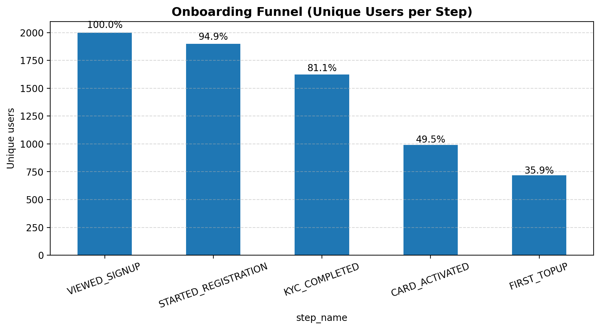
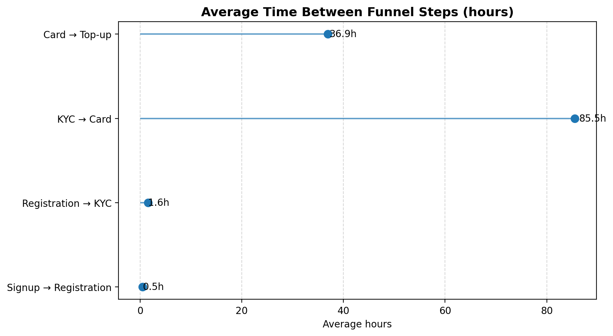
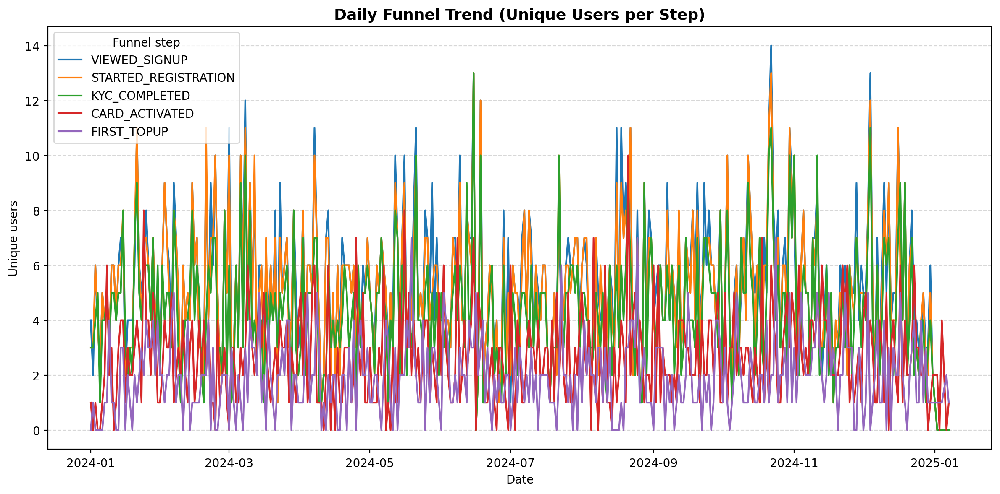
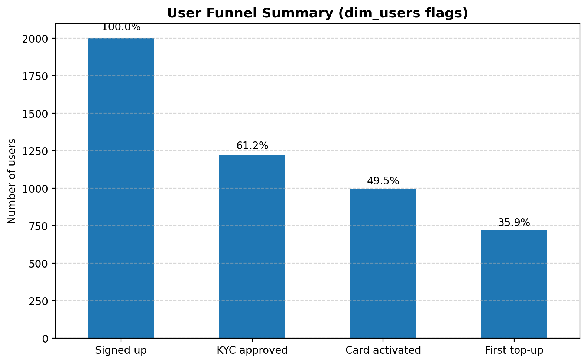
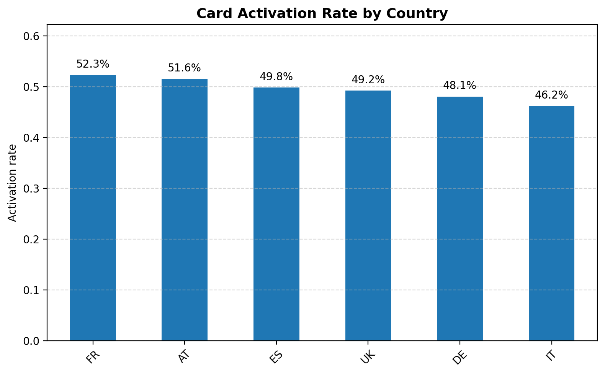
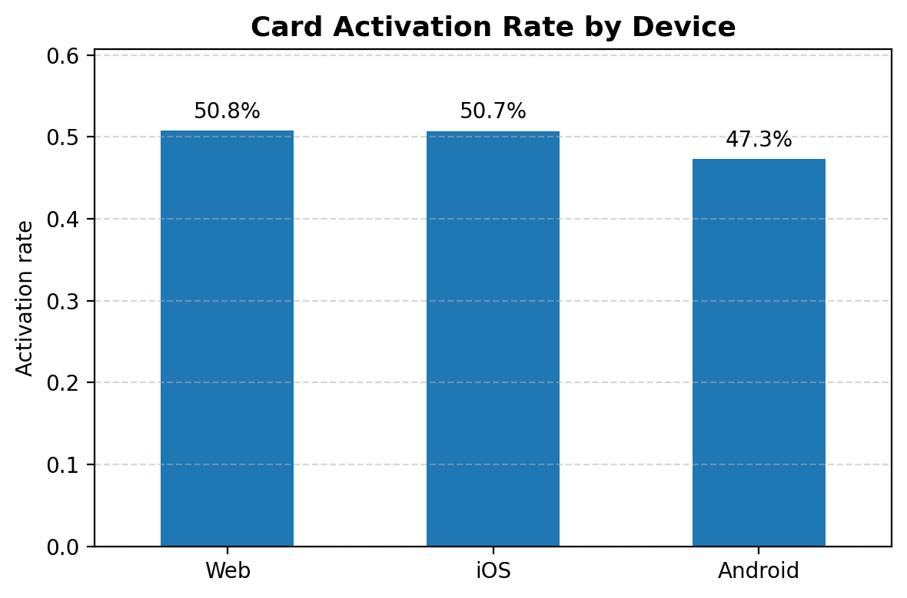
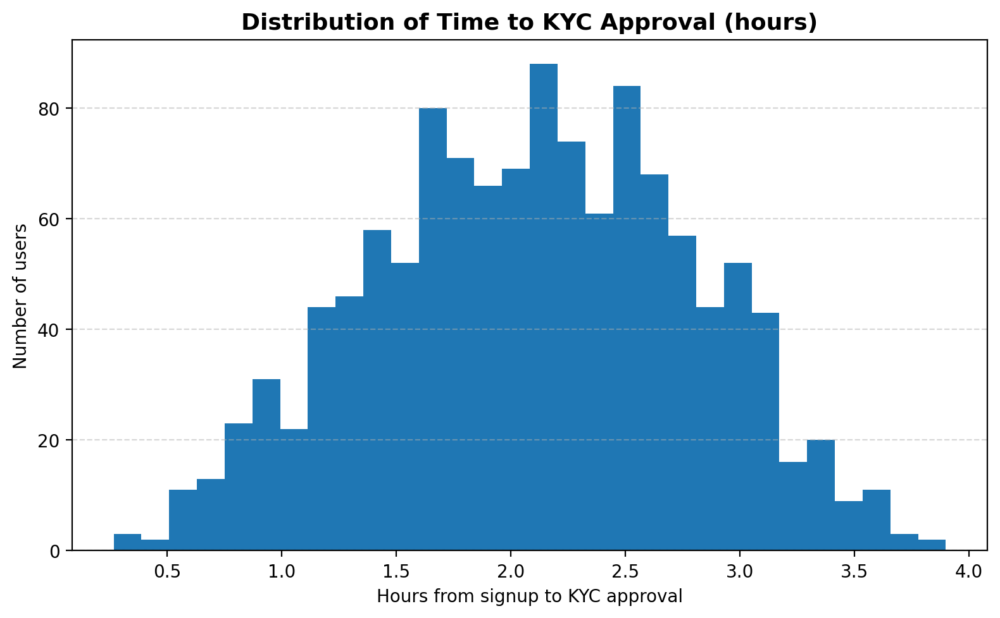
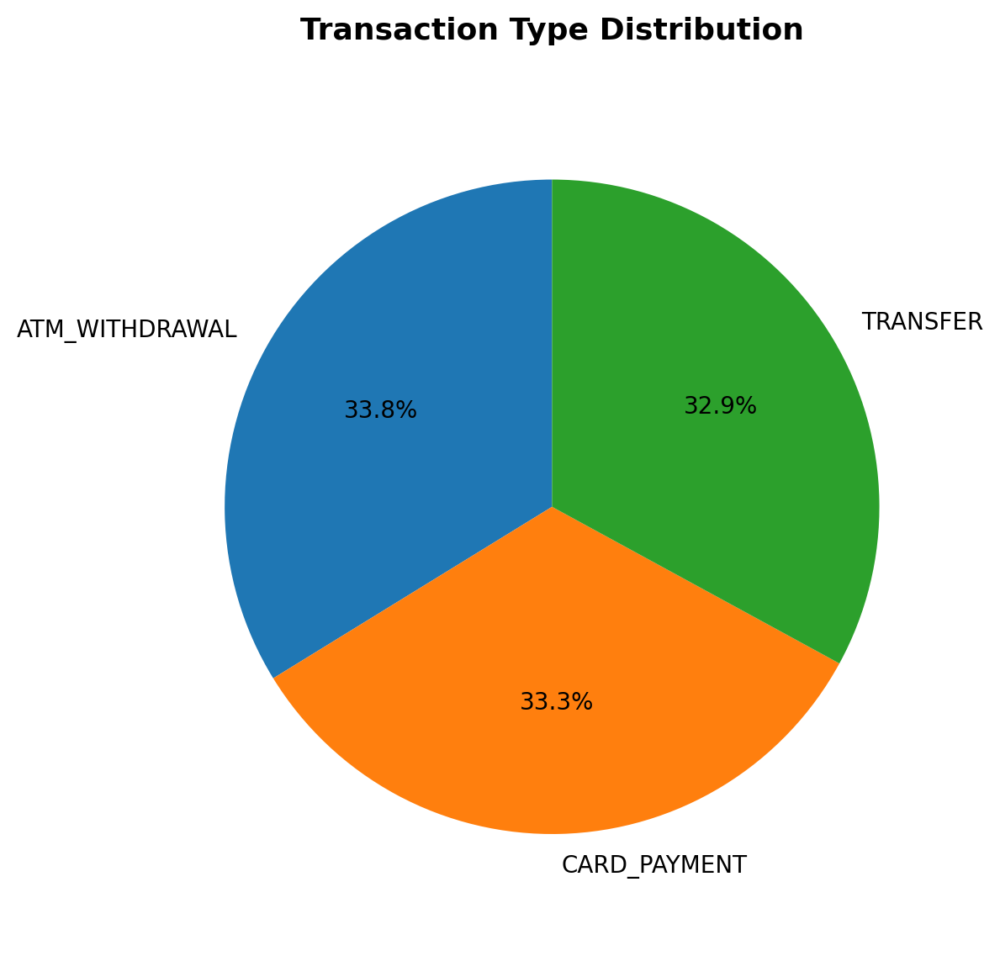
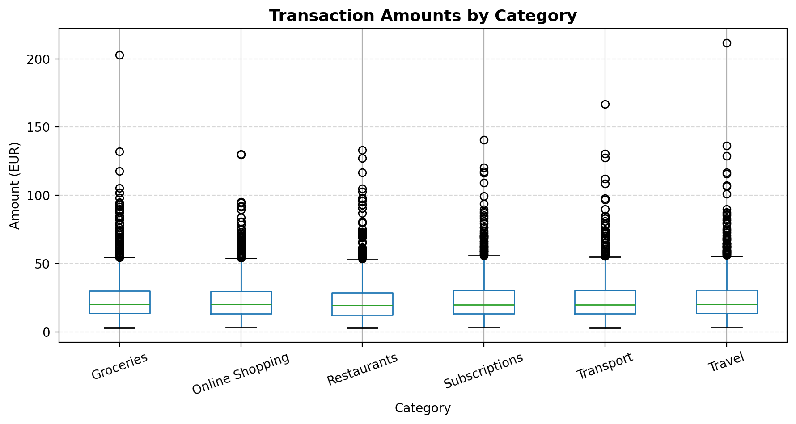
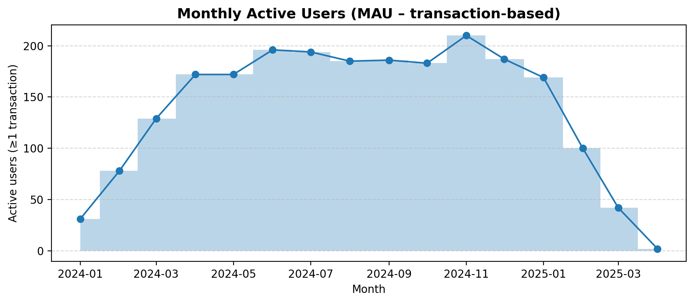

# Revolut Growth Analytics

This project is my first hands-on experience with building a full analytics engineering workflow.  
I created it specifically as part of my application for a **Data / Analytics Engineering Internship at Revolut**.

My goal was to learn and demonstrate how core components of Revolut’s data stack may work in practice:
- **ETL development** in Python  
- **data cleaning & transformation**  
- **analytics engineering** (LookML)  
- **funnel & growth analytics**  
- **dashboard creation** for decision-making  

Although I am new to ETL pipelines and LookML, I wanted to challenge myself next to my already experienced work in PowerBI, explore these technologies independently, and show that I can quickly learn and apply new tools.

This repository documents the entire journey from raw synthetic banking data → ETL pipeline → data models → dashboards.  
Each step is explained in a clear, notes-style format to reflect my learning process and thought structure. 

> **Note:**  
> This README is intentionally much longer than a typical production README.  
> Since the focus of this project was to explore the full analytics engineering workflow step by step, I kept all explanations, notes, and thought processes in a single place.  
> In a real development environment, this would be split into separate documentation files (ETL docs, data model docs, LookML docs, dashboard specs), but for this internship project I preferred to keep everything together, since it was my main documentation tool.

---

# 📋 How This README Is Structured

To make this project easy to understand and follow, the README is organized into clear, sequential steps.  
Each step mirrors one part of a real analytics engineering workflow at Revolut.

Here is the full structure:

1. **Synthetic Data Generation**  
   How I created realistic Revolut-style user, KYC, card, transaction and funnel data.

 -  🧬 [Go to Step 1](#step-1--synthetic-data-generation)

2. **ETL Pipeline (Python)**  
   How raw CSVs are cleaned, transformed and combined into warehouse tables.

- ⚙️ [Go to Step 2](#step-2--etl-pipeline-python)

3. **LookML Modeling**  
   How the semantic layer is built: dimensions, measures, and explores.

- 🧠 [Go to Step 3](#step-3--lookml-modeling)

4. **Dashboard Creation (Python)**  
   A minimal dashboard simulating what would normally be built in Looker.

-  📊 [Go to Step 4](#step-4--dashboard-creation-python-instead-of-looker)

5. **(Optional) Airflow DAG**  
   A conceptual example of how the ETL pipeline could be scheduled daily in production.
-  🌀 [Go to Step 5](#step-5--optional-airflow-dag-for-etl-orchestration)

6. **Final Summary & Reflection**  
   What I learned, why I built this project, and how it connects to the internship.
-  🎓 [Go to Step 6](#final-summary--reflection)
   - 📘 [What I Learned](#what-i-learned)  
   - 🎯 [Why I Built This Project](#why-i-built-this-project)  
   - 💜 [Final Words](#final-words)

To help reviewers:  
**All executable code is inside `etl/`, `notebooks/`, and `lookml/`**  
**All images for the dashboard are located in `images/`**  

---
---

# **Step 1 — Synthetic Data Generation**

### **Purpose**
To create a realistic dataset that simulates key parts of a digital banking user journey:
- User sign-up  
- KYC verification  
- Card activation  
- First top-up  
- Realistic spending patterns  
- Funnel step tracking

This ensures to later be able to perform product analytics and build dashboards without relying on sensitive real banking data.

### **Output Files**
Generated and saved to: data/raw/


| File | Description |
|------|-------------|
| `users.csv` | Basic user profile (signup timestamp, device, country, marketing channel) |
| `kyc.csv` | Start/end KYC timestamps + approval / failed / pending |
| `cards.csv` | Card activation events for approved users |
| `transactions.csv` | Simulated card payments, transfers, withdrawals |
| `funnel_events.csv` | Complete event history for funnel steps |

---

## Generation Logic (Notes)

Below is a detailed explanation of each generated table, including the exact columns and how each value was simulated.

---

## 📘 1. `users.csv`

| Column | Description | How it was generated |
|--------|-------------|-----------------------|
| `user_id` | Unique user identifier | Sequential integers from 1 to 2000 |
| `signup_at` | Timestamp of signup | Random datetime between Jan–Dec 2024 |
| `country` | User’s country | Random choice: AT/DE/UK/FR/ES/IT |
| `device` | Device type | Random choice: iOS, Android, Web |
| `marketing_channel` | Acquisition channel | Random choice: Organic, Social, Paid Search, etc. |

**Purpose:**  
Forms the core *dimension table* for all user-related joins and metrics.

---

## 📘 2. `kyc.csv`

| Column | Description | How it was generated |
|--------|-------------|-----------------------|
| `user_id` | Matches users table | Inherited from users who started KYC |
| `kyc_started_at` | When KYC began | signup time + random delay (5–120 mins after registration) |
| `kyc_completed_at` | When KYC finished | `started_at` + random duration (2–60 mins) |
| `kyc_status` | Final outcome | 75% APPROVED, 15% FAILED, 10% PENDING (probabilities) |

**Notes:**  
Only ~85% of users entered KYC.  
This table is key for compliance analytics and the funnel.

---

## 📘 3. `cards.csv`

| Column | Description | How it was generated |
|--------|-------------|-----------------------|
| `user_id` | Matches users | Only users with `kyc_status = APPROVED` |
| `card_activated_at` | When card was activated | KYC completion + random delay (0–7 days, + 10–180 mins) |
| `card_type` | Virtual or Physical | Random choice between the two |

**Notes:**  
Only ~80% of APPROVED users activate a card.  
Represents the next stage in the financial onboarding funnel.

---

## 📘 4. `transactions.csv`

| Column | Description | How it was generated |
|--------|-------------|-----------------------|
| `user_id` | Matches users | Only users who completed a first top-up |
| `transaction_time` | Timestamp of each spend event | First top-up time + random offset (0–90 days) |
| `amount_eur` | Transaction amount | Lognormal distribution (realistic 5–80€ average range) |
| `category` | Spending category | Random choice: Groceries, Restaurants, Transport, etc. |
| `merchant_country` | Country of merchant | Random choice from country list |
| `transaction_type` | Payment type | CARD_PAYMENT, ATM_WITHDRAWAL, TRANSFER |

**Notes:**  
Users make between **1–20 transactions** each.  
This forms your `fact_transactions` table later.

---

## 📘 5. `funnel_events.csv`

| Column | Description | How it was generated |
|--------|-------------|-----------------------|
| `user_id` | Unique user | Inherited from users |
| `step_order` | Funnel step number | 1–5 depending on how far the user progressed |
| `step_name` | Name of funnel step | VIEWED_SIGNUP, STARTED_REGISTRATION, KYC_COMPLETED, CARD_ACTIVATED, FIRST_TOPUP |
| `event_time` | Timestamp of the event | Generated from real timing logic (registration delay, KYC duration, activation delay, top-up delay) |

**Notes:**  
This is the **core table** for product analytics, conversion rates, and drop-off insights.

---

## 🔗 Funnel Flow (Simulated)

The final funnel looks like:

VIEWED_SIGNUP

STARTED_REGISTRATION

KYC_COMPLETED

CARD_ACTIVATED

FIRST_TOPUP

Each step has its own probability, delay, and timestamp pattern.

---
This will later be used to build funnel dashboards.

---

## ▶️ Run the Data Generator

```bash
uv run etl/generate_fake_data.py
```
---

# Step 2 — ETL Pipeline (Python)

### Purpose

The ETL pipeline transforms the raw CSV files from Step 1 into clean, analytics-ready warehouse tables.  
This mirrors how a real analytics engineering workflow at Revolut would structure raw → modeled data.

ETL = Extract → Transform → Load

---

# ETL Flow (Short Overview)

### Extract
- Load all raw CSV files from `data/raw/`
- Parse datetime columns for proper time calculations
- Ensure consistent schemas for all tables

### Transform

The transform step prepares **three different warehouse tables**:

#### 1. Transforming user-level data → `dim_users`
- Merge all user-level raw sources (`users`, `kyc`, `cards`, `transactions`)
- Aggregate to one row per user
- Derive behavioral flags:
  - `has_kyc_approved`
  - `has_card_activated`
  - `has_topup`
- Compute onboarding durations in hours:
  - signup → KYC  
  - KYC → card_activation  
  - card_activation → first_topup

#### 2. Transforming transactions → `fct_transactions`
- Clean transaction timestamps and enforce numeric types
- Add helpful time dimensions:
  - `transaction_date`
  - `transaction_hour`
- Keep one row per transaction for granular analysis

#### 3. Transforming funnel events → `fct_funnel`
- Sort funnel events chronologically for each user
- Enforce correct `step_order` typing
- Ensure there is one event per step per user
### Load
- Save all modeled tables to `data/warehouse/` in Parquet format
- Parquet is chosen because it is:
  - column-oriented (fast for analytics)
  - compressed (efficient)
  - used in modern data warehouses (BigQuery, Snowflake)
  - easy to preview with the VS Code “Parquet Viewer” extension

---

# 🗂️ Warehouse Tables Created

## 📘 1. `dim_users.parquet`
A dimension table containing one row per user with:

- country, device, marketing_channel  
- signup timestamp  
- KYC timestamps + final status  
- card activation timestamp + card type  
- first transaction timestamp  
- behavioral flags:
  - `has_kyc_approved`
  - `has_card_activated`
  - `has_topup`
- duration metrics in hours:
  - `time_to_kyc_hours`
  - `time_kyc_to_card_hours`
  - `time_card_to_first_tx_hours`

Purpose: Core user-level model for onboarding, funnel conversion, and behavioral insights.

---

## 📘 2. `fct_transactions.parquet`
A fact table with one row per transaction, including:

- `transaction_time`
- `transaction_date`
- `transaction_hour`
- `amount_eur`
- `category`
- `merchant_country`
- `transaction_type`

Purpose: Transaction-level analysis for revenue, spending patterns, and time-based analytics.

---

## 📘 3. `fct_funnel.parquet`
A funnel event table with one row per onboarding step:

- `user_id`
- `step_order`
- `step_name`
- `event_time`

Purpose: Conversion funnel analysis, drop-off identification, and sequencing of onboarding events.

---

# ▶️ Run the ETL Pipeline
uv run etl/etl_pipeline.py

This generates all warehouse tables under:

They can be viewed using:
- VS Code “Parquet Viewer”
- or loaded via Pandas / any BI tool.

---

# Step 3 — LookML Modeling

### Purpose

In this step, the warehouse tables created by the ETL pipeline are turned into a **semantic analytics layer** using LookML.  
LookML defines how Looker interprets the tables, which fields exist, how they relate to each other, and which measures are available for analysis.

LookML is not a transformation language.  
It does not change or modify the warehouse tables.  
Instead, it provides a clean, reusable layer of business logic that dashboards can use.

---

# Views (Semantic Layer for Each Table)

For each warehouse table (`dim_users`, `fct_transactions`, `fct_funnel`), a LookML **view** was created.

A view contains:

- **dimensions** (fields you can filter or group by)
- **dimension_groups** (for timestamps with automatic timeframes)
- **measures** (aggregations such as counts, sums, averages, filtered counts)
- **data types** (string, number, yesno, time)
- **SQL definitions** describing how to reference each column

This allows Looker to generate the correct SQL when building dashboards.

---

## 📘 1. dim_users.view.lkml

This view models the user-level dimension table and includes:

- user attributes: country, device, marketing_channel  
- KYC timestamps and status  
- card activation fields  
- first transaction timestamp  
- total_transactions and total_amount_eur  
- boolean flags such as `has_kyc_approved`, `has_card_activated`, `has_topup`  
- onboarding duration metrics in hours  
- measures like:
  - users_count  
  - approved_users  
  - card_activation_rate  

This enables onboarding funnels, country/device breakdowns, and conversion metrics.

---

## 📘 2. fct_transactions.view.lkml

This view models the transactions fact table with:

- transaction timestamps (including date and hour)
- amount_eur
- category
- merchant_country
- transaction_type

Measures include:

- transactions_count  
- total_amount_eur  
- avg_transaction_amount_eur  
- filtered counts (CARD_PAYMENT, ATM_WITHDRAWAL, TRANSFER)

This enables revenue analytics, spending behaviour, and time-based insights.

---

## 📘 3. fct_funnel.view.lkml

This view represents the funnel events for user onboarding:

- step_order  
- step_name  
- event_time  

Measures include:

- steps_count  
- distinct users per step  
- funnel step breakdowns (e.g., viewed_signup_users)

This allows building funnel dashboards and analyzing where users drop off.

---

# 🔗 Relationship to Warehouse

Each LookML view references its warehouse table using:

`sql_table_name: table_name ;;`

This tells Looker which table to query.  
LookML does not store data — it only models how to query it.

---

# 🧪 LookML Model File

### Purpose

The LookML model file defines the **entry points for analysis** in Looker.  
While views describe *what fields exist*, the **model file** describes:

- which views belong to the project  
- which explores are available to users  
- how the tables join together  
- which table acts as the starting point for analysis  

This step turns the individual views into a **complete semantic data model** that Looker can use to automatically generate SQL for dashboards.

---

# 📂 Explores (Starting Points for Analysis)

Explores are the “entry tables” users see when building queries in Looker.

In this project, three explores were created:

### **1. `explore: dim_users` (Primary Explore)**  
- Starting point: one row per user  
- Joins to:
  - `fct_transactions`
  - `fct_funnel`
- Used for:
  - onboarding funnels  
  - KYC → card → top-up analysis  
  - segmentation by country, device, marketing_channel  

### **2. `explore: fct_transactions`**  
- Starting point: one row per transaction  
- Joins to `dim_users`  
- Used for:
  - revenue analytics  
  - spending patterns  
  - transaction types and categories  

### **3. `explore: fct_funnel`**  
- Starting point: one row per funnel event  
- Joins to `dim_users`  
- Used for:
  - analyzing where users drop off  
  - comparing funnel performance across segments  

---

# 🔗 Join Logic

All tables join on `user_id`:

- **dim_users ←→ fct_transactions**  
  - relationship: one user → many transactions  
- **dim_users ←→ fct_funnel**  
  - relationship: one user → many funnel events  

---
### Note on Looker / LookML Access

The LookML layer in this project is fully defined:

- warehouse tables are modeled as LookML views,
- explores are configured for users, transactions, and funnel events,
- joins between `dim_users`, `fct_transactions`, and `fct_funnel` are documented.

In a real company setup, this LookML model would be connected to a **Looker instance**, and product/growth teams would build interactive dashboards on top of it.

However, Looker (the enterprise BI tool that uses LookML) is not available as a personal or free development environment — it is typically only accessible inside companies.  
That means I cannot run or visually test the LookML explores and dashboards myself here.

Instead, I chose to:

- design the LookML layer conceptually,  
- and then **simulate the dashboards using Python**, based on the same warehouse tables.

I am genuinely excited to work with a real Looker + LookML stack during the internship, where this kind of model can be connected to a live environment and turned into production dashboards.

---

# Step 4 — Dashboard Creation (Python instead of Looker)

### Purpose

In a real Revolut environment, the LookML model from Step 3 would be connected to a **Looker instance**.  
Looker dashboards are normally used for:

- onboarding funnels  
- KYC and card activation metrics  
- conversion and growth analytics  
- transaction behaviour  
- segmentation by country, device, and marketing channel  
- cohort and retention analysis  

Since Looker is **not available publicly**, the dashboarding step of this project is implemented using **Python**, based on the warehouse tables from Step 2.

> **Note:**  
> The notebook (`notebooks/analytics_overview.ipynb`) contains additional comments for each chart, including **proposals for how to make each visual more advanced**, segmentation ideas, and scaling opportunities.

---

## Why Python instead of Looker?

Looker is a paid enterprise BI application and cannot be accessed locally or for personal projects.  
Because of this:

- I cannot render the LookML explores inside Looker but.. 
- ✔️ I *can* still build the LookML modeling layer (Step 3)  
- ✔️ I can replicate the dashboards using Python + Matplotlib  

I also already have dashboarding experience in **Power BI**, and I’m excited to extend this skillset to Looker during the internship.

The Python example dashboard is intentionally **minimal** — the goal is to illustrate analytical thinking and how to extract product insights from the warehouse tables.

---

## What this step includes

A small Python-based analytics dashboard showing:

- the event-level funnel  
- the user-level funnel  
- time-to-complete for each onboarding step  
- activation metrics (by country & device)  
- transaction behaviour  
- category distributions and spending patterns  
- monthly active users (MAU)

All visuals are generated in: notebooks/analytics_overview.ipynb

---

# Dashboard Visuals (Python)

Below are the key visuals included in the dashboard.  
Each answers a core growth/product analytics question.

---

## **1️⃣ Event-Level Onboarding Funnel**  
**Question answered:** Where do users drop off during onboarding?



---

## **2️⃣ Average Time Between Funnel Steps**  
**Question answered:** How long does each onboarding step take on average?



---

## **3️⃣ Daily Funnel Trend**  
**Question answered:** Are onboarding step volumes stable over time?



---

## **4️⃣ User-Level Funnel Summary**  
**Question answered:** What percentage of users complete the full onboarding flow?



---

## **5️⃣ Card Activation Rate by Country**  
**Question answered:** Which markets convert the best?



---

## **6️⃣ Card Activation Rate by Device**  
**Question answered:** Which platform has the strongest conversion rate?



---

## **7️⃣ Distribution of Time to KYC Approval**  
**Question answered:** How long does KYC usually take?



---

## **8️⃣ Transaction Type Distribution**  
**Question answered:** What do users most commonly do with their card?



---

## **9️⃣ Transaction Amounts by Category**  
**Question answered:** Which categories show high or low spending amounts?



---

## **🔟 Monthly Active Users**  
**Question answered:** How many users perform at least one transaction per month?



---

# Step 5 — (Optional) Airflow DAG for ETL Orchestration

### Purpose

So far, this project already covers:

- ETL and warehouse tables (Python)
- a semantic layer (LookML)
- analytical visuals (Python dashboard)

In a real data/analytics engineering setup, there is usually one more piece:

> **Orchestration** — a tool that decides *when* and *in which order* jobs run.

I assume at Revolut, or similar companies, this role is often covered by **Apache Airflow**.

To reflect that, I added a small, conceptual **Airflow DAG** that shows how the ETL pipeline in this project could be scheduled in production.

---

## 🌀 Understanding the Airflow DAG (Simple Explanation)

File: dags/revolut_etl_dag.py

This Airflow DAG defines one daily workflow called `revolut_growth_etl_daily`.

It performs two conceptual steps:

1. **(Optional) Generate synthetic banking data**  
   → calls: `etl/generate_fake_data.py`

2. **Run the ETL pipeline to refresh the warehouse tables**  
   → calls: `etl/etl_pipeline.py` (`run_etl()` function)

The DAG is scheduled as a daily job:

- runs every day at **06:00**
- execution order: `generate_fake_banking_data` → `run_etl_pipeline`
- uses `PythonOperator` to directly call Python functions from this repository

This is exactly how orchestration works in modern analytics engineering environments.

---

## Why this DAG is included

This DAG serves as:

- a **learning exercise** (my first practical exposure to Airflow-style orchestration)  
- an **architecture signal** showing I understand how ETL → warehouse → scheduling interact  

It is **not required** to run this project.  
The repository works fully even without Airflow installed.

However, this DAG demonstrates how the existing ETL pipeline can move from:

> run this script manually on my laptop

to:

> automatically run this pipeline every morning in a production environment

---

## 🔄 How ETL, LookML, Dashboards & Airflow Work Together  
(Super simple, high-level view)

- **ETL (Python)**  
  Raw CSV → clean → transform → output warehouse tables  

- **Warehouse tables**  
  `dim_users`, `fct_funnel`, `fct_transactions`  
  → these are the single source of truth

- **LookML (views + model)**  
  Defines *how* these warehouse tables are queried  
  (dimensions, measures, joins, explores)

- **Dashboards (Python here, Looker in reality)**  
  Uses the LookML logic to answer business questions  
  (funnels, activation, transactions, growth metrics)

- **Airflow (this step)**  
  Schedules and orchestrates *when* ETL runs  
  → keeps dashboards and models always fresh and up-to-date

---
---


# Final Summary & Reflection

This project brings together the essential components of a modern analytics engineering workflow — mirroring how teams at Revolut might move from raw events to insight generation.

Below is a simple overview of how each step connects to the next:

## 🔄 How Everything Fits Together (A more detailed Overview)

### **1. Raw Data → ETL Pipeline**
Raw CSV files are extracted, cleaned, and transformed using Python.  
The goal is to turn messy, event-level information into **analysis-ready warehouse tables**.

**Output:**  
`dim_users.parquet`, `fct_funnel.parquet`, `fct_transactions.parquet`

---

### **2. Warehouse Tables → LookML Views**
Each warehouse table is described in LookML (dimensions, measures, timegroups).  
LookML does *not* change the data — it just defines **how analysts can query it**.

**Output:**  
`dim_users.view.lkml`, `fct_funnel.view.lkml`, `fct_transactions.view.lkml`

---

### **3. LookML Views → LookML Model (Explores + Joins)**
The model file connects the views together using keys like `user_id`.  
This creates an **Explore**, which is Looker’s place for building dashboards.

**Output:**  
`revolut_growth.model.lkml`

---

### **4. Explores → Dashboards**
In a real Revolut environment, dashboards would now be built directly in Looker.  
Since Looker is not publicly available, this step is simulated using Python.

**Output:**  
`notebooks/analytics_overview.ipynb` + full Python visual pack  
(images saved to `images/`)

---

# What I Learned

Working on this project taught me (on a very simple and beginner basis):

- how to design and structure an ETL pipeline from scratch  
- how to create warehouse-style tables that are easy to analyze  
- how to build a semantic model using LookML  
- how dimensions, measures, and explores work together  
- how product funnels and financial analytics are built in practice  
- how to use Python to produce analytics dashboards similar to Looker  

It also strengthened my understanding of:

- onboarding funnels  
- activation metrics  
- transaction behaviour  
- country/device segmentation  
- performance measurement and growth analytics  

---

# Why I Built This Project

This repository was created specifically for my application to the  
**Data / Analytics Engineering Internship at Revolut**.

I wanted to:

- show that I can learn new tools quickly (ETL, LookML, warehouse modeling)  
- demonstrate real analytical thinking with product and growth data  
- build something close to Revolut’s real analytics stack  
- prove my curiosity, ownership, and ability to independently execute a full mini-project  

This project was my first time working with ETL pipelines and LookML but also thinking about orchestration and end-to-end data workflow —  
and I genuinely enjoyed every part of the process and the things got very clear very quickly.

It made me even more excited about the Data / Analytics Engineering internship at Revolut, where these components come together in a real, high-impact production environment.

---

# Final Words

Thank you for taking the time to review this project.

I would be excited to continue working with these tools — especially LookML and deeper warehouse modeling — inside Revolut's environment.

I’m highly motivated to:

- learn from experienced Analytics Engineers  
- contribute to growth and onboarding insights  
- work across product, operations, and data teams  
- bring strong ownership, speed, and problem-solving  
- and develop real impact for millions of users

I can’t wait to bring this energy, curiosity, and willingness to learn into the internship.


